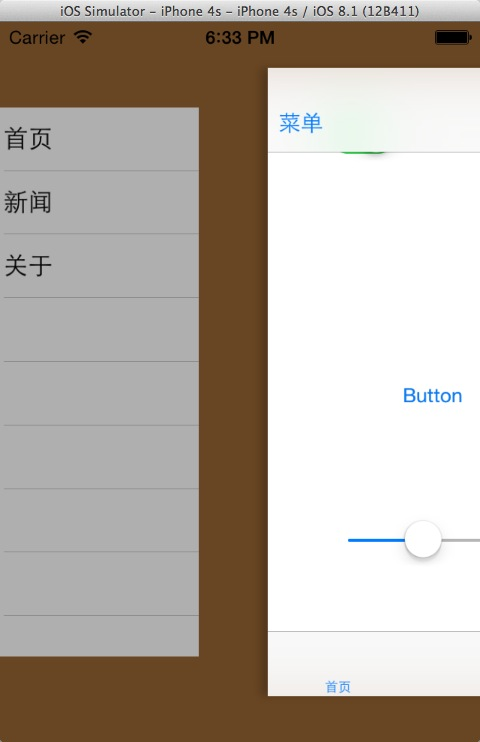
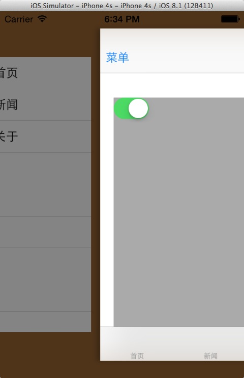
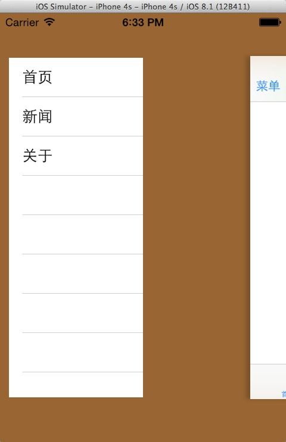

#CoreHamburgerManagerVC
####汉堡菜单，高度解耦，您想怎么搞就怎么搞！

 
##框架特性： 
>1.支持所有ios版本（ios6-ios8），没有版本压力！ 
>2.支持大屏的横竖屏，不再担心横屏变形了。 
>3.本框架高度解耦，不是一键式，请注意！你需要了解本框架的结构 CoreHamburgerManagerVC是父类控制器，你需要指定两个控制器，一个是左侧的控制器就是你的汉堡菜单控制器，一个是主体控制器。虽然是叫左侧控制器，但是三个控制器均是全屏布局，只是说左侧控制器内容需要你自行控制。 
>4 CoreHamburgerManagerVC是单例对象，你可很方便的获取。

 
##安装说明： 
>1.将CoreHamburgerManagerVC文件夹放入您的项目中 
>2.#import "CoreHamburgerManagerVC.h" 
>3.初始化汉堡菜单控制器，指明左侧控制器，主体控制器，背影视图（因为背影显示什么图片，颜色，需要你自行考虑），缩放比例，左移距离。

    CoreHamburgerManagerVC *hamburgerManagerVC=[CoreHamburgerManagerVC hamburgerManagerVCWithMainVC:navVC bgView:bgView leftVC:leftVC scale:.8f leftMargin:280.0f];
    
    
>4.是否展示左侧菜单

    @property (nonatomic,assign,readonly) BOOL leftVCShowing;                                //是否展示左侧菜单控制器

>5.在你想要的地方请调用以下方法即可展示左侧菜单或者关闭

    /*
     *  展示左侧的汉堡包菜单
     */
    -(void)showHamburgerMeauVC;

    /*
     *  隐藏左侧的汉堡包菜单
     */
    -(void)hideHamburgerMeauVC;

>6.并不是所有的页面都需要这个效果，所以这个效果默认是关闭的，你要手动在需要手势滑动左侧菜单的页面添加这个功能：

    //调用
    -(void)addPanView:(UIView *)panView;
    
     CoreHamburgerManagerVC *hvc=[CoreHamburgerManagerVC sharedCoreHamburgerManagerVC];
    
    [hvc addPanView:self.view];
    
>7.这个手势默认是和以下两种功能冲突： 
    >>7.1 scrollView 
    >>7.2 右滑返回（右滑弹出栈顶控制器，参见https://github.com/nsdictionary/SwipeNavigationVC） 
  本框架仍然是可以处理这个冲突的，示例中关于页面就是一个scrollView，处理这个冲突需要只需两步：
    （1）调用-(void)addPanView:(UIView *)panView; 添加手势功能 
    （2）在您的scrollView页面左侧添加一个空白的view即可。
   
  
 
##看看效果图吧
 
 
 
  

 

-----
    CorePullScale 表格顶部图片下拉放大控件，`一键式安装`，异常简单！   感谢您的关注！ 
-----

  

#### 版权说明 RIGHTS  
作品说明：本框架由iOS开发攻城狮Charlin制作。 
作品时间： 2015.02.23日 11:21  

#### 关于Chariln INTRODUCE  
作者简介：Charlin-四川成都华西都市报旗下华西都市网络有限公司技术部iOS工程师！  

#### 联系方式 CONTACT  
Q    Q：1761904945（请注明缘由） 
Mail：1761904945@qq.com 

